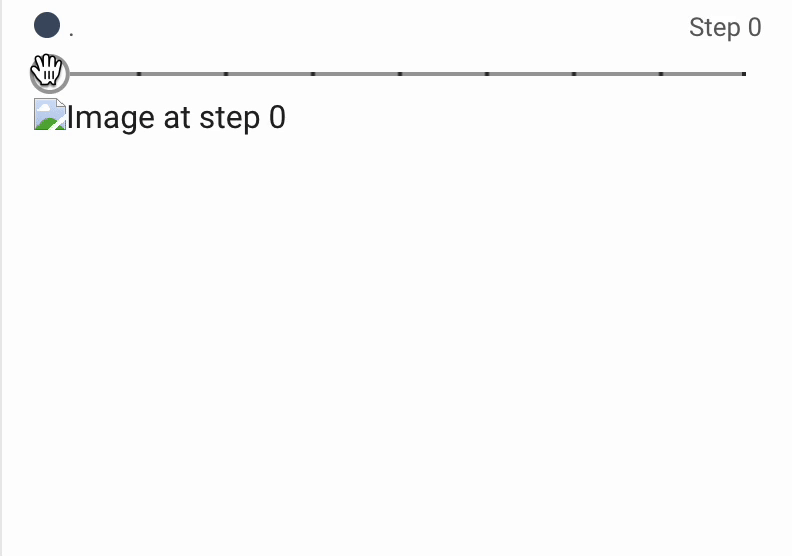
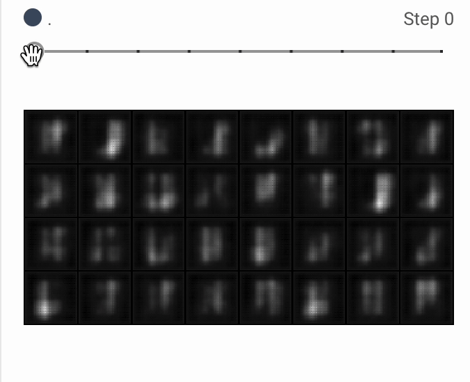

# GAN-DCGAN Image Generation Project

## Project Description
The project aims to demonstrate the team's understanding of deep neural networks and their optimization for image generation using Generative Adversarial Networks (GANs). GANs are employed as an advancement from traditional deep learning algorithms, specifically for prediction tasks like object detection and segmentation. The team will explore the impact of different network architectures on the quality of generated images. The project comprises two main steps: training a simple GAN on the MNIST dataset, followed by training a Deep Convolutional Generative Adversarial Network (DCGAN) on the same dataset. A comparison will be drawn between the results obtained from the two architectures.

## Technique
The implementation of GANs for image generation involves multiple factors that influence the output, such as optimizer type, learning rate, data normalization, and model architecture. GANs function similarly to humans in terms of making mistakes, receiving feedback, and improving over time. The "Generator" plays the role of the human, while the "Discriminator" acts as the critic. The loss function is based on the discriminator's feedback, which guides the generator to optimize its weights in the direction that reduces the loss. Improving the quality of the discriminator is crucial to provide better feedback to the generator, as it directly influences the generator. GANs have two loss functions that are optimized with each epoch. The discriminator's task is to differentiate between real and generated images, while the generator's objective is to produce convincing images that can deceive the discriminator into thinking they are real. Once the generator can generate images that closely resemble the training data, the discriminator becomes redundant and can be discarded. The generator can then be utilized to create new, similar images.

## Software & Hardware
The project utilizes the following software libraries and tools:

- NumPy: v.1.22.4
- Python: v.3
- Matplotlib: v.3.7.1
- PyTorch: v.2
- Tensorboard: v.1.6
- Google Collab

## Methodology
To implement a GAN for image generation in PyTorch, the methodology involves the following steps:

1. Define the Generator and Discriminator Networks: The generator and discriminator networks are defined using the nn.Module class in PyTorch. The generator network may consist of fully connected or convolutional layers followed by an activation function, while the discriminator network might consist of convolutional layers followed by a sigmoid activation function to produce the binary classification output.

2. Define the Loss Functions: The loss functions for the generator and discriminator are defined using the nn.BCELoss class in PyTorch, which implements binary cross-entropy loss. The generator loss is computed by passing the synthetic data through the discriminator network and comparing the output to a target value of 1 (indicating that the synthetic data is real). The discriminator loss is computed by comparing the output of the discriminator on real and synthetic data to their respective target values (1 = real data, 0 = synthetic data).

3. Define the Optimizers: The optimizers for the generator and discriminator are defined using the torch.optim module in PyTorch, which provides a variety of optimization algorithms, including stochastic gradient descent (SGD) and Adam.

4. Train the GAN: The GAN is trained by defining a training loop that alternates between updating the generator and discriminator networks. Within each iteration, synthetic data is generated using the generator, and the loss for the generator and discriminator is computed using both the real and synthetic data. Finally, the gradients are backpropagated, and the network parameters are updated using the optimizer.

Overall, this methodology provides a framework for implementing a GAN in PyTorch, involving defining the generator and discriminator networks, loss functions, optimizers, and training the GAN through a training loop.

## Architectures Used (GAN & DCGAN)
Initially, the project experimented with Simple GANs using fully connected layers for an image generation task. However, the results were mixed and found to be insufficient. To address this, the team switched to using DCGANs, which employ a deep convolutional neural network architecture for both the generator and discriminator networks. The generator network also incorporates batch normalization and transposed convolutional layers for upsampling low-dimensional noise into high-dimensional images. With DCGANs, the team observed the generation of higher quality, complex, and realistic digits compared to the binary images produced by Simple GANs.

## Results

|     GAN     |     DCGAN     |
|:--------------:|:--------------:|
| | |

## Conclusion

The results demonstrate that the DCGAN outperforms the Simple GAN in generating better and more accurate images for the same number of epochs. Although both models use the same loss and optimization algorithm, they produce different outputs. The Simple GAN generates images resembling salt and pepper noise, requiring many epochs to resemble a digit. On the other hand, the DCGAN exhibits patterns and shapes resembling MNIST data as early as the second epoch. This highlights the convolutional neural network's ability to capture complex patterns, making it well-suited for computer vision applications.

The project encountered several technical challenges, such as selecting appropriate hyperparameters for the model, including learning rate, batch size, and number of epochs. Experimentation and determination of optimal values were time-consuming. Additionally, training GANs can be computationally expensive, especially for large datasets, necessitating access to powerful computing resources. These challenges were addressed by leveraging the team's machine learning expertise, conducting careful experimentation and tuning, and utilizing adequate computational resources.

The main takeaway from the project is that the DCGAN architecture is more effective than the Simple GAN for generating high-quality images of handwritten digits. The DCGAN's use of convolutional layers and batch normalization allows it to learn more complex features and capture the spatial structure of the images. Furthermore, the DCGAN's ability to generate diverse images with fine details emphasizes the importance of employing appropriate network architectures for generative modeling tasks.

## Requirements
To run this project, you need the following dependencies:

- NumPy: v.1.22.4
- Python: v.3
- Matplotlib: v.3.7.1
- PyTorch: v.2
- Tensorboard: v.1.6

Note: The network was trained on the free Google Colab tier.

## Instructions
Follow the steps below to execute the project:

1. **Install necessary dependencies.**
   
2. **Move the files onto a separate folder.**

3. **Open the terminal, and switch to the correct Conda environment.**

4. **To run the program, open the .ipynb files using Jupyter Notebook or Google Colab and execute each cell.**

   Note: The execution takes approximately ~20 minutes on a GPU (more on a CPU). After the execution, you will be able to use Tensorboard to visualize the intermediate training results, which showcase the learning curve of the Generative Adversarial Network.
